# Manual de Operación Nexus: Empleados y Aprovisionamiento

**Procesos cubiertos:** Altas, Bajas y Cambio de contraseña

---

## Control del documento

| Campo | Valor |
|---|---|
| Nombre del documento | Manual de Operación Nexus: Empleados y Aprovisionamiento |
| Versión | 1.0 |
| Fecha de emisión | [Pendiente] |
| Elaboró | [Pendiente] |
| Revisó | [Pendiente] |
| Autorizó | [Pendiente] |
| Áreas destinatarias | Recursos Humanos, Sistemas, Colaborador |
| Próxima revisión | [Pendiente] |

### Historial de cambios

| Versión | Fecha | Descripción del cambio | Responsable |
|---|---|---|---|
| 1.0 | [Pendiente] | Emisión inicial del documento | [Pendiente] |

---

## 1. Objetivo

Establecer el procedimiento estándar para el alta, la baja y el cambio de contraseña de colaboradores en los sistemas internos, mediante la plataforma Nexus y la mesa de servicio GLPI, definiendo con claridad qué ejecuta Recursos Humanos, qué ejecuta Sistemas y qué recibe el colaborador.

## 2. Alcance

Aplica a todo movimiento de personal que implique creación, cambio de credencial o revocación de accesos a los sistemas internos de la organización.

### 2.1 Dentro del alcance

- Registro del expediente del colaborador en Nexus.
- Solicitud formal de aprovisionamiento mediante GLPI.
- Aprovisionamiento y desaprovisionamiento en: cuenta de dominio Staff (correo), GLPI e Intranet.
- Cambio y propagación de contraseñas.
- Validación y cierre documental del movimiento.
- Primer acceso del colaborador a sus plataformas.

### 2.2 Fuera del alcance

**Cuentas de Microsoft 365.** Nexus no está integrado con Microsoft en esta fase. Toda alta o baja de cuenta Microsoft se ejecuta de forma manual en la consola de administración por parte de Sistemas.

**Activos y equipamiento.** Asignación de equipo de cómputo, telefonía y activos físicos.

**Sistemas de terceros** no listados en el módulo de Aprovisionamiento de Nexus.

**Movimientos pendientes de documentar.** Los siguientes movimientos no están cubiertos por este manual y se documentarán en un manual independiente, de uso exclusivo del área de Sistemas:

- Alta de accesos adicionales a un colaborador ya aprovisionado.
- Revocación parcial de accesos sin dar de baja al colaborador.
- Corrección de datos del expediente, con excepción del número de empleado, que no es editable.
- Reactivación de un colaborador dado de baja previamente.

Mientras ese manual no exista, cualquiera de estos casos debe escalarse al responsable del área de Sistemas antes de ejecutar cualquier acción en Nexus.

## 3. Documentos relacionados

| Documento | Estado | Destinatario |
|---|---|---|
| Guía rápida: Alta y baja de colaboradores (RRHH) | Pendiente | Recursos Humanos |
| Guía rápida: Aprovisionamiento en Nexus (Sistemas) | Pendiente | Sistemas |
| Manual de movimientos especiales en Nexus | Pendiente | Sistemas |
| Ayuda en línea de Nexus | Pendiente | Todos los usuarios |

## 4. Sistemas involucrados

| Sistema | Función en el proceso | Áreas que lo usan |
|---|---|---|
| **Nexus** | Expediente del colaborador y motor de aprovisionamiento | RRHH, Sistemas |
| **GLPI** | Mesa de servicio: canal formal de solicitud, seguimiento y evidencia | RRHH, Sistemas, Colaborador |
| **Correo de dominio Staff** | Cuenta institucional del colaborador | Colaborador |
| **Intranet** | Portal interno del colaborador | Colaborador |
| **Consola Microsoft 365** | Gestión manual de cuentas Microsoft, fuera de Nexus | Sistemas |

## 5. Roles y responsabilidades

El proceso requiere **dos niveles de acceso distintos**. Recursos Humanos registra la información del colaborador y solicita el aprovisionamiento; Sistemas aplica el aprovisionamiento en las plataformas. Ninguna de las dos áreas puede completar el proceso por sí sola.

| Actividad | RRHH | Sistemas | Colaborador |
|---|---|---|---|
| Registrar el expediente del colaborador en Nexus | **R** | I | - |
| Definir los accesos requeridos por el puesto | **R** | C | - |
| Generar el ticket de solicitud en GLPI | **R** | I | - |
| Ejecutar el aprovisionamiento en Nexus | I | **R** | - |
| Generar y resguardar la contraseña inicial | - | **R** | - |
| Documentar y solucionar el ticket en GLPI | C | **R** | - |
| Aprobar o rechazar la solución del ticket | **R** | I | - |
| Entregar credenciales al colaborador | **R** | I | - |
| Cambiar la contraseña inicial en el primer acceso | I | I | **R** |
| Solicitar la baja de un colaborador | **R** | I | - |
| Ejecutar la baja en Nexus y en Microsoft 365 | I | **R** | - |

R = Responsable de ejecutar, C = Consultado, I = Informado

## 6. Políticas de operación

Estas reglas son de observancia obligatoria para ambas áreas.

1. **Ningún movimiento en Nexus se ejecuta sin un ticket previo en GLPI.** El ticket es la autorización y la evidencia del movimiento.
2. **Verificación por número de empleado.** Antes de ejecutar cualquier acción, Sistemas debe confirmar que el número de empleado del ticket coincide exactamente con el registro en Nexus, para evitar movimientos sobre la persona equivocada.
3. **El número de empleado no es editable después de guardar.** RRHH debe validarlo antes de confirmar el alta.
4. **La contraseña generada se muestra una sola vez.** Debe copiarse y resguardarse en un medio seguro en ese mismo momento; no existe forma de recuperarla desde Nexus.
5. **La contraseña inicial es temporal.** El colaborador debe cambiarla de inmediato en su primer acceso, ya que la credencial quedó expuesta durante su entrega.
6. **El nombre de usuario lo genera Nexus automáticamente.** Se construye con primer nombre y primer apellido; en caso de duplicado agrega un consecutivo numérico. No se captura ni se modifica manualmente.
7. **Todo movimiento se cierra documentado.** Sistemas debe registrar la solución en GLPI con la plantilla correspondiente antes de dar por concluido el movimiento.
8. **Las cuentas de Microsoft 365 se gestionan de forma manual.** Nexus no las controla. Toda alta o baja de cuenta Microsoft debe ejecutarse directamente en la consola de administración.
9. **La baja no elimina datos.** El expediente del colaborador se conserva en Nexus; lo que se revoca es el acceso a las plataformas.
10. **Escalamiento por urgencia.** Si una baja es urgente, RRHH debe notificarla adicionalmente por vía directa a Sistemas, por ejemplo su extensión telefónica. El contacto directo no sustituye la generación del ticket.

## 7. Mapa general del proceso

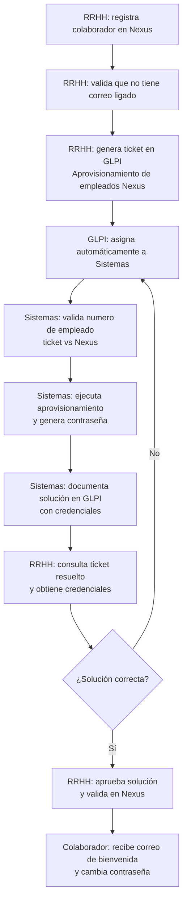
```mermaid
flowchart TD
    A[RRHH: registra colaborador en Nexus] --> B[RRHH: valida que no tiene correo ligado]
    B --> C[RRHH: genera ticket en GLPI<br/>Aprovisionamiento de empleados Nexus]
    C --> D[GLPI: asigna automáticamente a Sistemas]
    D --> E[Sistemas: valida numero de empleado<br/>ticket vs Nexus]
    E --> F[Sistemas: ejecuta aprovisionamiento<br/>y genera contraseña]
    F --> G[Sistemas: documenta solución en GLPI<br/>con credenciales]
    G --> H[RRHH: consulta ticket resuelto<br/>y obtiene credenciales]
    H --> I{¿Solución correcta?}
    I -->|No| D
    I -->|Sí| J[RRHH: aprueba solución<br/>y valida en Nexus]
    J --> K[Colaborador: recibe correo de bienvenida<br/>y cambia contraseña]
```

---

# PARTE I: PROCEDIMIENTO DE ALTA

## 8. Alta: actividades de Recursos Humanos (Fase 1, registro y solicitud)

**Responsable:** Recursos Humanos
**Precondición:** Contar con la información mínima del colaborador y el número de empleado asignado.

### 8.1 Ingresar a Nexus

Inicie sesión en Nexus con las credenciales compartidas del área. Al ingresar visualizará únicamente los módulos a los que su perfil tiene acceso.

<!-- IMG: RRHH_1_NEXUS_MODULOS -->
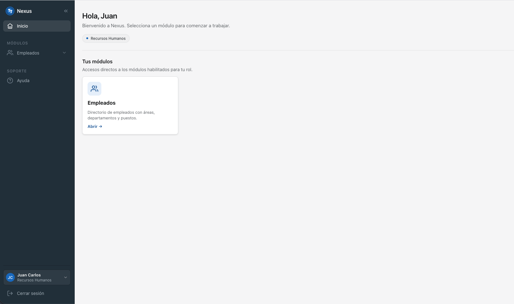

### 8.2 Abrir el módulo de Empleados

Diríjase al módulo **Empleados**. Se desplegará la vista principal del módulo. En la esquina superior derecha haga clic en **Nuevo empleado**.

<!-- IMG: RRHH_2_NEXUS_MODULO_EMPLEADOS -->
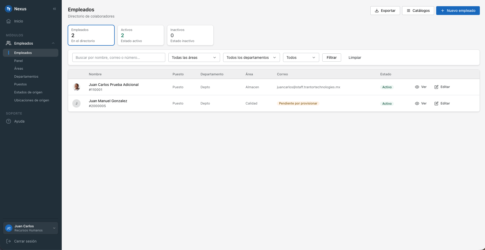

### 8.3 Abrir el formulario de alta

Al hacer clic se mostrará el formulario principal con los datos mínimos requeridos para dar de alta a un colaborador.

<!-- IMG: RRHH_3_NEXUS_NUEVO_EMPLEADO -->
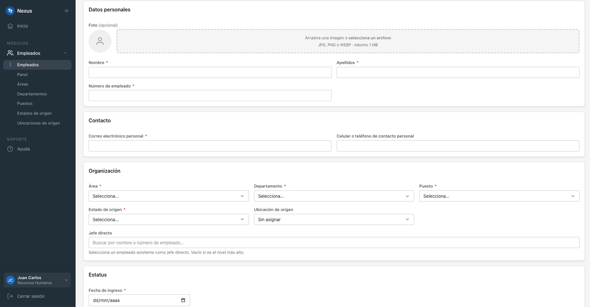

### 8.4 Capturar la información del colaborador

Complete todos los campos obligatorios, identificados con asterisco rojo.

Consideraciones:

- Puede cargar la fotografía del colaborador. Es recomendable hacerlo. El peso máximo del archivo es de **1 MB**.
- **Valide el número de empleado antes de guardar.** Una vez guardado no podrá editarse.

<!-- IMG: RRHH_4_NEXUS_NUEVO_EMPLEADO_FORMULARIO_LLENO -->
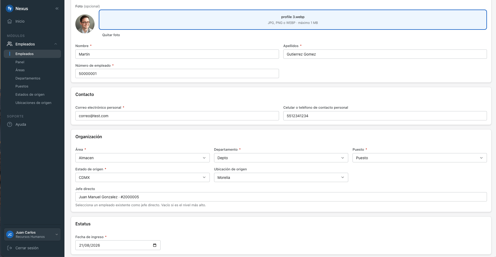

### 8.5 Confirmar la creación del expediente

Al guardar se mostrará el detalle del expediente inicial del colaborador. Confirme que los datos se guardaron correctamente.

<!-- IMG: RRHH_5_NEXUS_NUEVO_EMPLEADO_CREADO -->
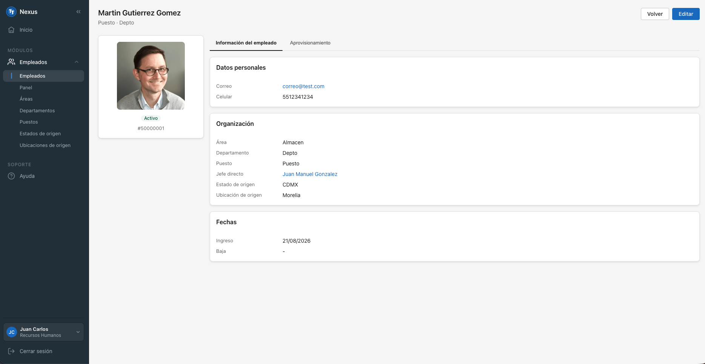

### 8.6 Verificar el estado de aprovisionamiento

En la pestaña **Aprovisionamiento** podrá confirmar que el colaborador aún no tiene una cuenta de correo ligada. Este es el punto en el que corresponde solicitar el aprovisionamiento a través de GLPI.

<!-- IMG: RRHH_6_NEXUS_NUEVO_EMPLEADO_CREADO_TAB_APROVISIONAMIENTO -->
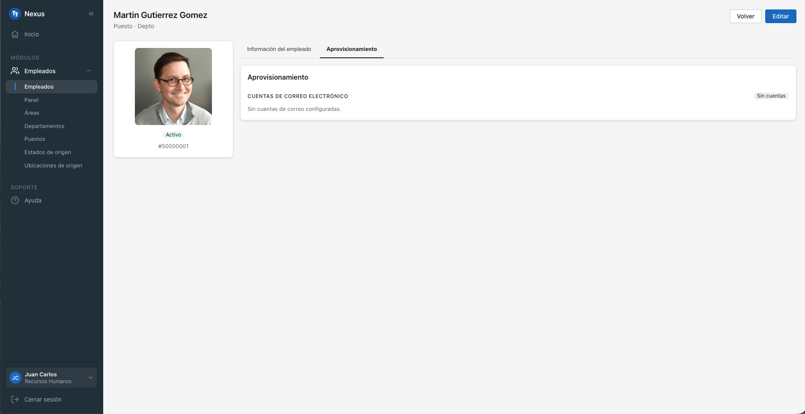

### 8.7 Ingresar a GLPI

Acceda a GLPI con las credenciales compartidas del área.

<!-- IMG: RRHH_7_GLPI_PANTALLA_PRINCIPAL -->
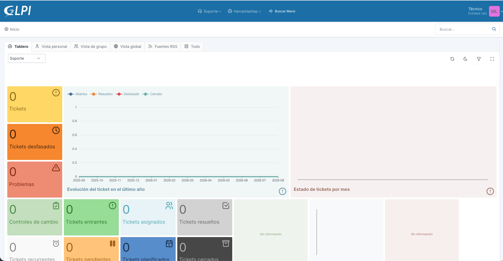

### 8.8 Abrir el catálogo de servicios

En el menú **Soporte**, seleccione la opción **Catálogo de servicios**.

<!-- IMG: RRHH_8_GLPI_CATALOGO_DE_SERVICIOS -->
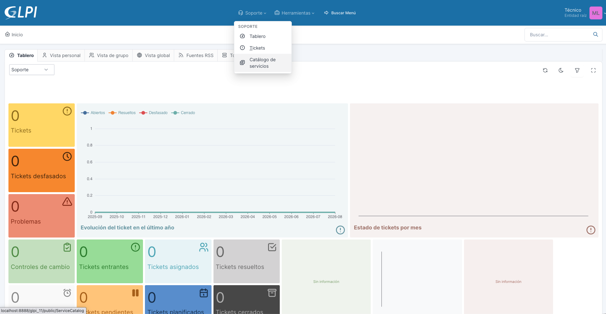

### 8.9 Seleccionar el formulario de aprovisionamiento

Dentro de la categoría **Sistemas Internos** encontrará el formulario **Aprovisionamiento de empleados (Nexus)**, preparado específicamente para el alta y baja de colaboradores. Este formulario es visible únicamente para el grupo de RRHH. Haga clic para ingresar.

<!-- IMG: RRHH_9_GLPI_APROVISIONAMIENTO_EN_NEXUS -->
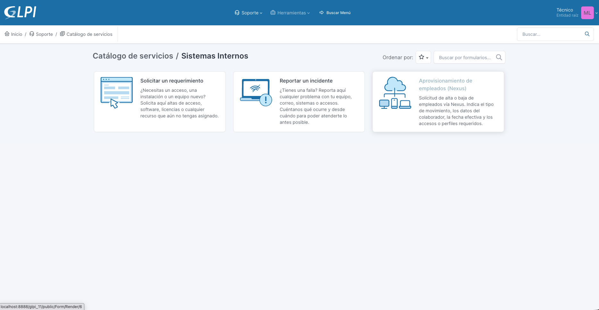

### 8.10 Llenar la solicitud de alta

Complete el formulario con los datos solicitados:

- **Tipo de movimiento:** seleccione **Alta**.
- **Detalle de la solicitud:** el campo se prellena con los accesos a sistemas por defecto. Ajústelo según los accesos que realmente requiere el puesto del colaborador.

<!-- IMG: RRHH_10_GLPI_SOLICITUD_DE_ALTA -->
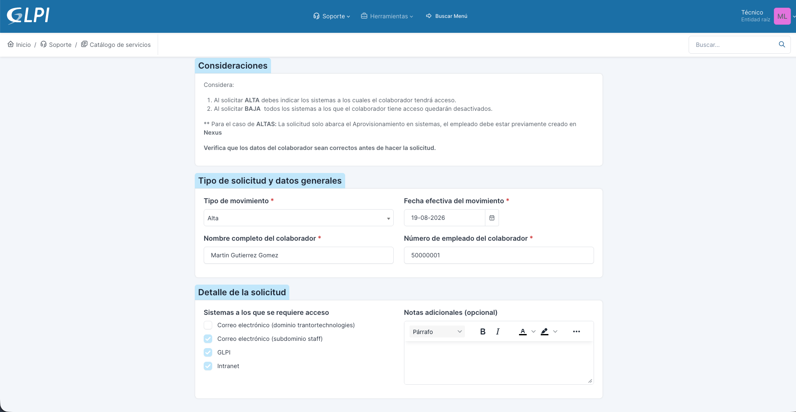

### 8.11 Confirmar la generación del ticket

Al enviar el formulario se mostrará la confirmación con el número de ticket generado. Puede hacer clic directamente sobre ella para ir al ticket. En el ejemplo se generó el ticket 2473.

<!-- IMG: RRHH_11_GLPI_SOLICITUD_DE_ALTA_CREADA -->
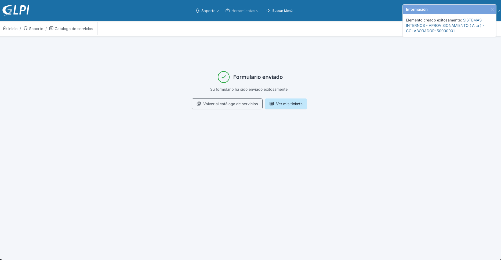

### 8.12 Verificar la asignación automática

Al ingresar al detalle del ticket confirmará que ya fue asignado automáticamente al responsable del área de Sistemas. En este punto no se requiere ninguna acción adicional de RRHH; corresponde esperar la atención.

<!-- IMG: RRHH_12_GLPI_SOLICITUD_DE_ALTA_DETALLE_YA_ASIGNADA -->
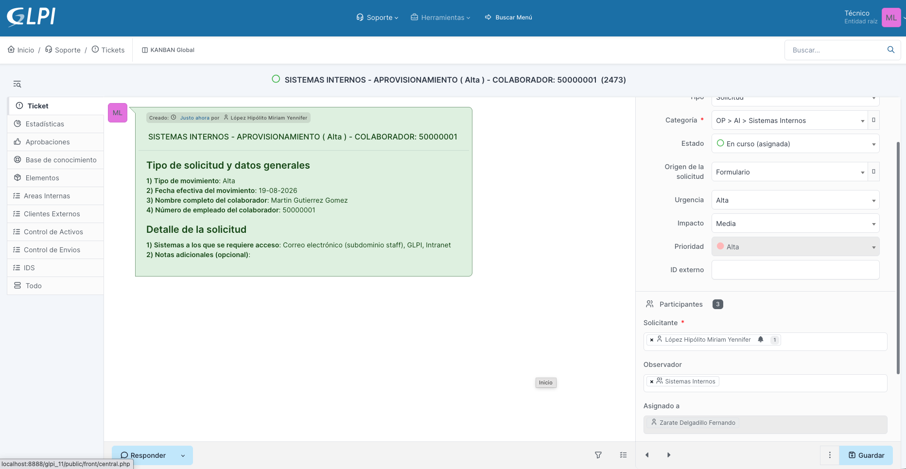

### 8.13 Dar seguimiento a los tickets pendientes

Para consultar los tickets pendientes de atención, ingrese al menú **Soporte** y después al submenú **Tickets**.

<!-- IMG: RRHH_13_GLPI_MIS_TICKETS_VISIBLE_SOLICITUD_ALTA -->

---

## 9. Alta: actividades de Sistemas (Fase 2, ejecución del aprovisionamiento)

**Responsable:** Sistemas
**Precondición:** Existe un ticket de alta asignado en GLPI.

### 9.1 Revisar los tickets asignados

Ingrese a GLPI con sus credenciales y consulte sus tickets. Identificará la solicitud de alta.

<!-- IMG: SIST_1_GLPI_TICKETS_ABIERTOS_CON_SOLICITUD_ALTA -->

### 9.2 Analizar el detalle de la solicitud

Al ingresar podrá ver el detalle de la solicitud, la fecha en que fue generada y, en el campo **SLA**, la fecha de vencimiento del compromiso de atención.

> **Punto crítico:** ponga especial atención al **número de empleado**. Es el dato que evita ejecutar acciones sobre un colaborador equivocado.

<!-- IMG: SIST_2_GLPI_SOLICITUD_DE_ALTA_DETALLE -->
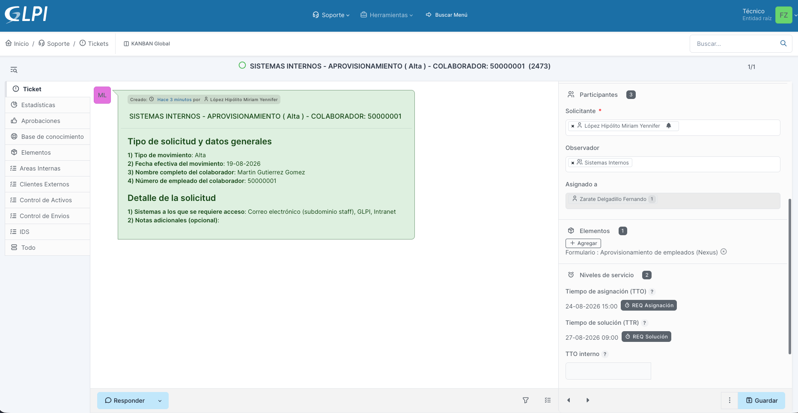

### 9.3 Ingresar a Nexus

Acceda a Nexus. Visualizará los módulos habilitados para su perfil.

<!-- IMG: SIST_3_NEXUS_MODULOS -->
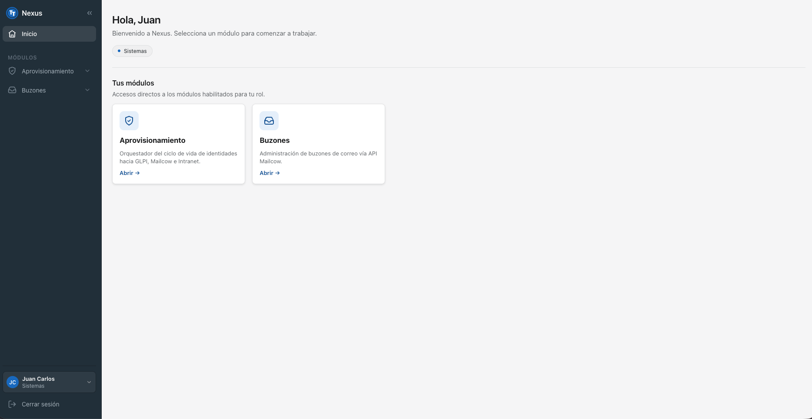

### 9.4 Abrir el módulo de Aprovisionamiento

Haga clic en el módulo **Aprovisionamiento** y después en el submenú **Empleados**.

<!-- IMG: SIST_4_NEXUS_MODULO_EMPLEADOS -->
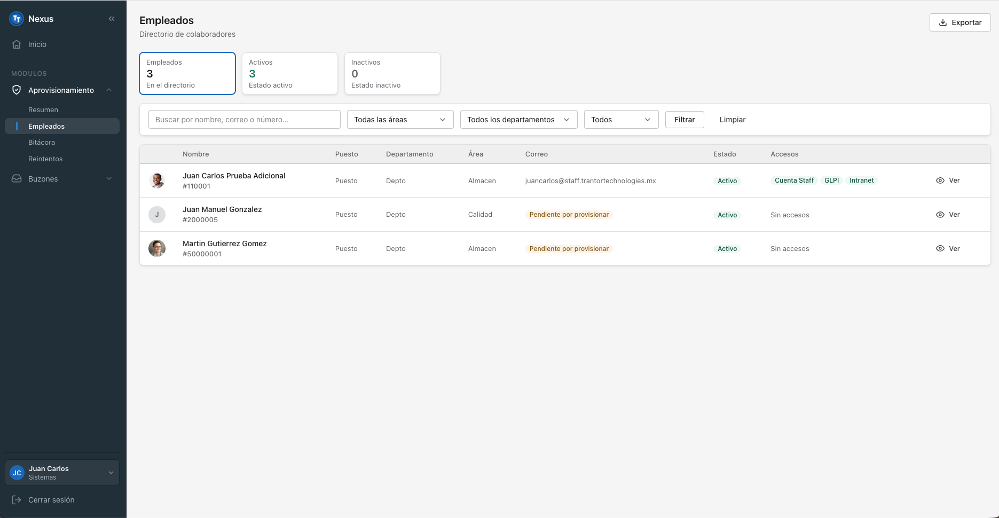

### 9.5 Localizar al colaborador

Se mostrará el listado completo de colaboradores. Realice la búsqueda por **número de empleado** y presione Enter. Al obtener el resultado, haga clic sobre el registro y confirme que los datos coinciden con los de la solicitud en GLPI.

<!-- IMG: SIST_5_NEXUS_MODULO_EMPLEADOS_BUSQUEDA -->
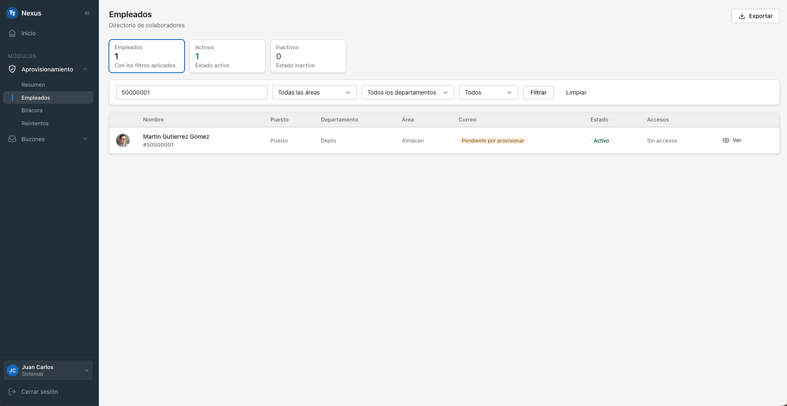

### 9.6 Seleccionar los sistemas y generar la contraseña

Diríjase a la pestaña **Aprovisionamiento**. Ahí verá los módulos a los que puede otorgar acceso. Verifique en la solicitud de GLPI qué sistemas debe aprovisionar y seleccione únicamente esos. En el ejemplo se otorga acceso a una cuenta nueva de dominio Staff, GLPI e Intranet.

Haga clic en **Generar y copiar contraseña**.

> **Punto crítico:** resguarde la contraseña en un lugar seguro en ese mismo momento. No hay forma de volver a visualizarla en pasos posteriores.

<!-- IMG: SIST_6_NEXUS_EMPLEADO_TAB_APROVISIONAMIENTO -->
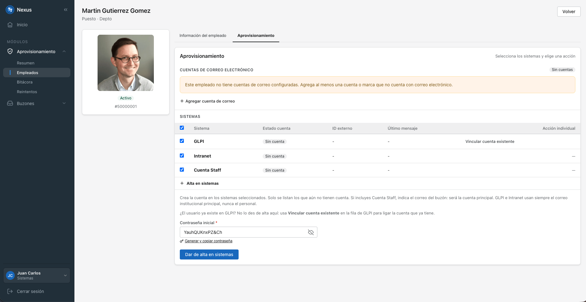

### 9.7 Confirmar el alta en sistemas

Confirme el alta en el cuadro de diálogo.

<!-- IMG: SIST_7_NEXUS_GENERAR_CONTRASENA_Y_DAR_DE_ALTA_EN_SISTEMAS -->

### 9.8 Obtener la cuenta creada

Una vez confirmado, se mostrará la cuenta Staff generada.

Consideraciones sobre el nombre de usuario:

- No es necesario capturarlo. Nexus lo genera automáticamente tomando el **primer nombre y el primer apellido**. En el ejemplo se creó `martin.gutierrez`.
- Si en el futuro existe otro colaborador con el mismo nombre, el sistema generará `martin.gutierrez1` y así sucesivamente.
- Este comportamiento no se controla de forma manual.

En esta pantalla obtendrá el correo creado. La contraseña ya fue copiada en el paso 9.6.

<!-- IMG: SIST_8_NEXUS_CONFIRMACION_DE_APROVISIONAMIENTO -->
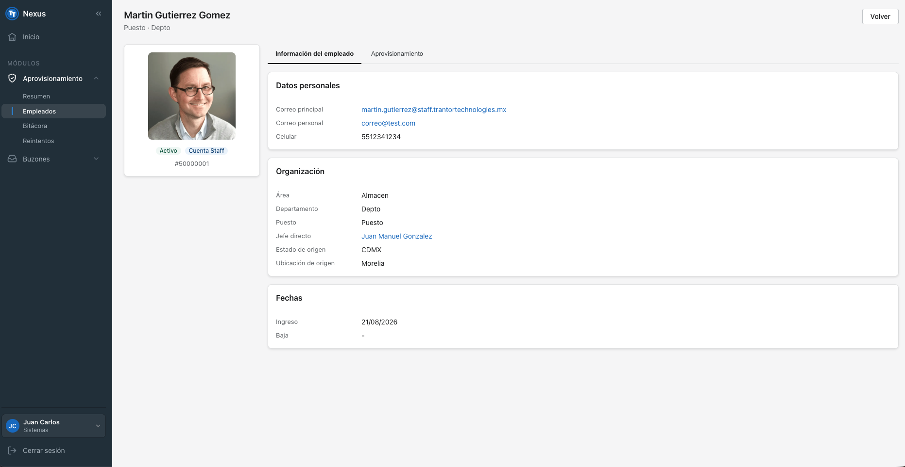

### 9.9 Validar los accesos otorgados

Verifique en la pestaña **Aprovisionamiento** que los sistemas otorgados corresponden a los solicitados.

<!-- IMG: SIST_9_NEXUS_CONFIRMACION_DE_APROVISIONAMIENTO_TAB_APROVISIONAMIENTO -->
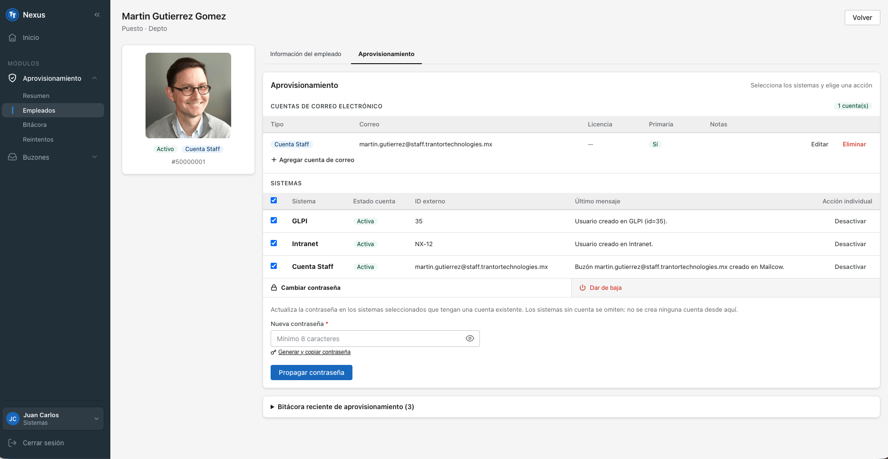

### 9.10 Iniciar el cierre del ticket en GLPI

Regrese a GLPI para cerrar el ticket y comunicar las credenciales a RRHH. Dentro del ticket, haga clic en la flecha del botón **Responder** y seleccione la opción **Solución**.

<!-- IMG: SIST_10_GLPI_SOLUCIONAR_TICKET -->
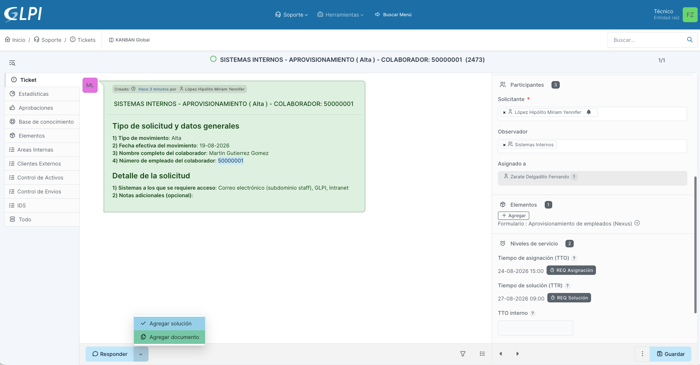

### 9.11 Clasificar la solución

En el selector de la derecha del recuadro desplegado seleccione **Resolución - Remota**, y en el selector inferior seleccione **Remota**.

<!-- IMG: SIST_11_GLPI_RESOLUCION_REMOTA -->
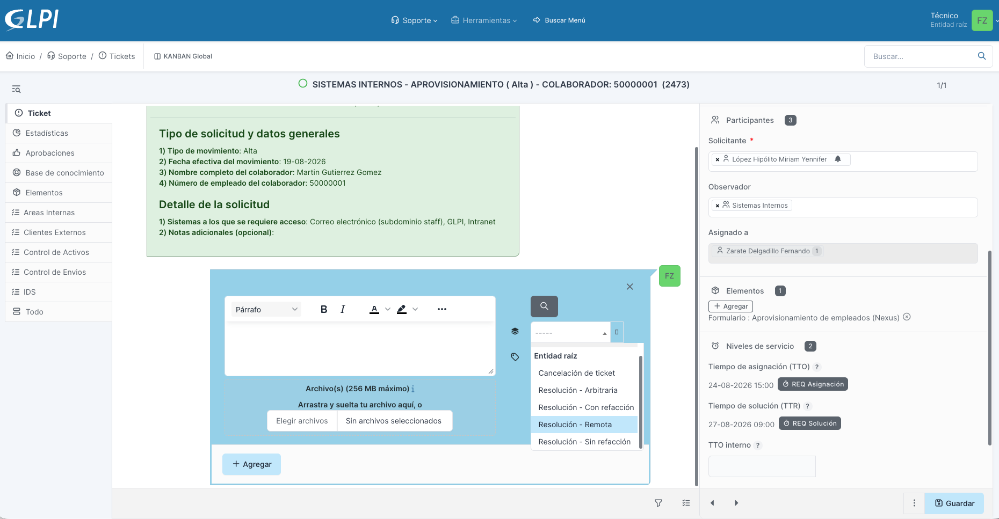

### 9.12 Revisar la plantilla automática

Al clasificar la solución, GLPI cargará automáticamente una plantilla de respuesta.

<!-- IMG: SIST_12_GLPI_RESOLUCION_REMOTA_PLANTILLA_AUTOMATICA -->
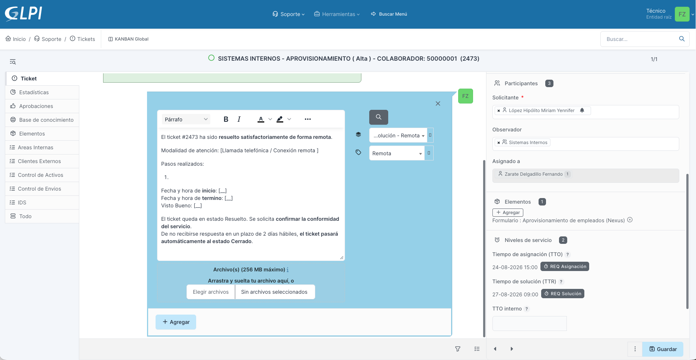

### 9.13 Documentar los accesos iniciales

Reemplace los valores entre corchetes `[ ]` de la plantilla con los datos reales, de forma que queden documentados los accesos iniciales entregados.

<!-- IMG: SIST_13_GLPI_RESOLUCION_REMOTA_PLANTILLA_AUTOMATICA_CON_DATOS -->
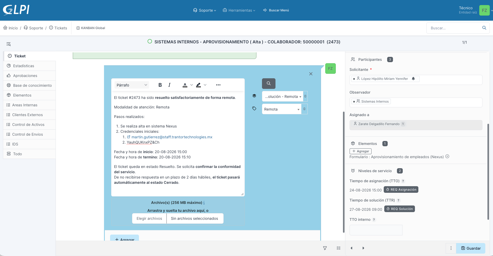

### 9.14 Registrar la solución

Una vez capturados los datos de cierre, haga clic en **Agregar**. Con esto concluye el flujo de aprovisionamiento del lado de Sistemas.

<!-- IMG: SIST_14_GLPI_RESOLUCION_BOTON_AGREGAR -->
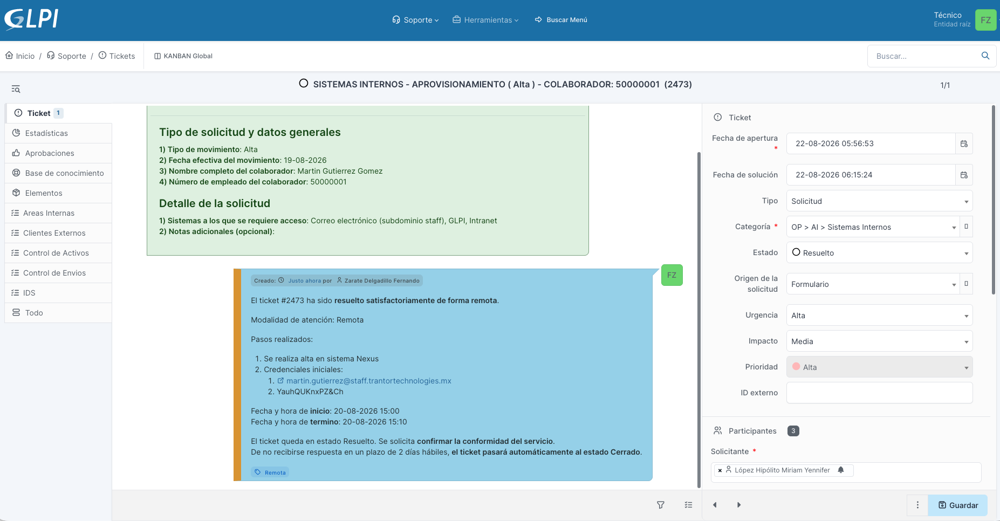

---

## 10. Alta: actividades de Recursos Humanos (Fase 3, validación y cierre)

**Responsable:** Recursos Humanos
**Precondición:** Sistemas registró la solución del ticket.

### 10.1 Ingresar a GLPI para validar

Después de recibir la confirmación del área de Sistemas, ingrese nuevamente a GLPI.

<!-- IMG: RRHH_14_GLPI_PANTALLA_PRINCIPAL -->
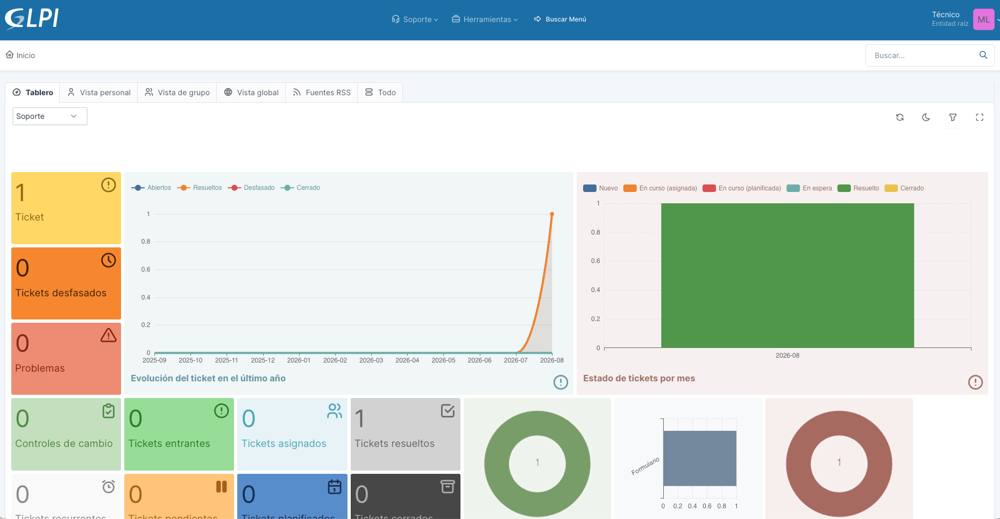

### 10.2 Localizar el ticket resuelto

Ingrese a **Soporte** y después a **Tickets**. Si la solicitud ya no aparece en el listado, es porque fue resuelta por Sistemas. Haga clic en la tarjeta **Tickets resueltos** para desplegarlos.

<!-- IMG: RRHH_15_GLPI_CARD_TICKETS_RESUELTOS -->
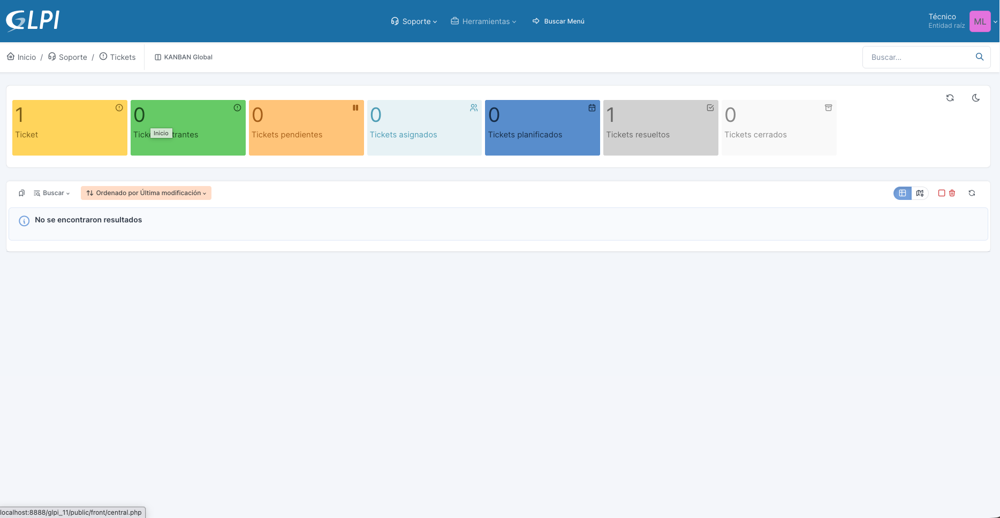

### 10.3 Buscar por número de ticket

Alternativamente puede localizar el ticket capturando su número en el campo **Buscar**.

<!-- IMG: RRHH_16_GLPI_CARD_TICKETS_RESUELTOS_DETALLE -->
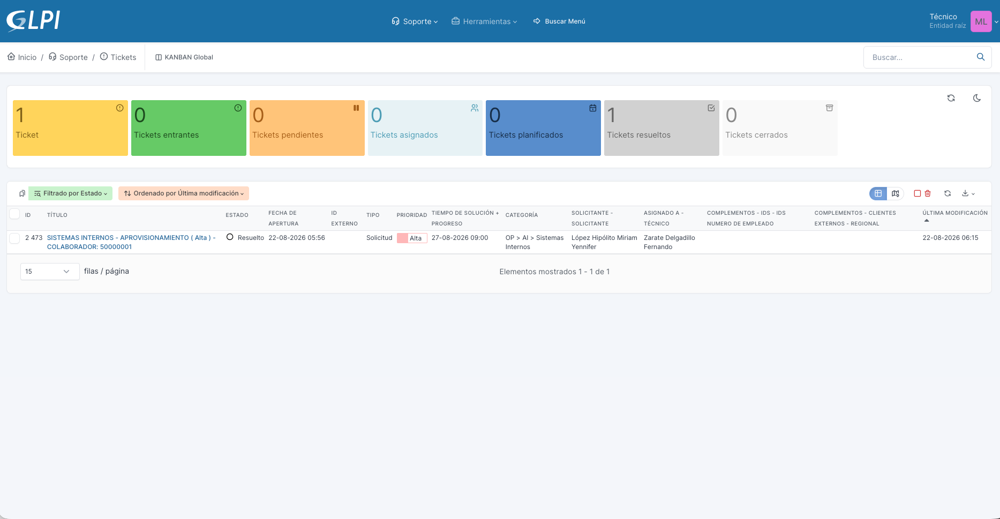

### 10.4 Obtener las credenciales

Al ingresar al detalle del ticket visualizará el **correo** y la **contraseña** de acceso a los sistemas solicitados. Se trata de credenciales iniciales; el colaborador debe cambiarlas de inmediato, tal como se le indica en el correo de bienvenida que recibe automáticamente después del aprovisionamiento.

<!-- IMG: RRHH_17_GLPI_TICKET_RESUELTO_CON_DATOS_DE_ACCESO -->
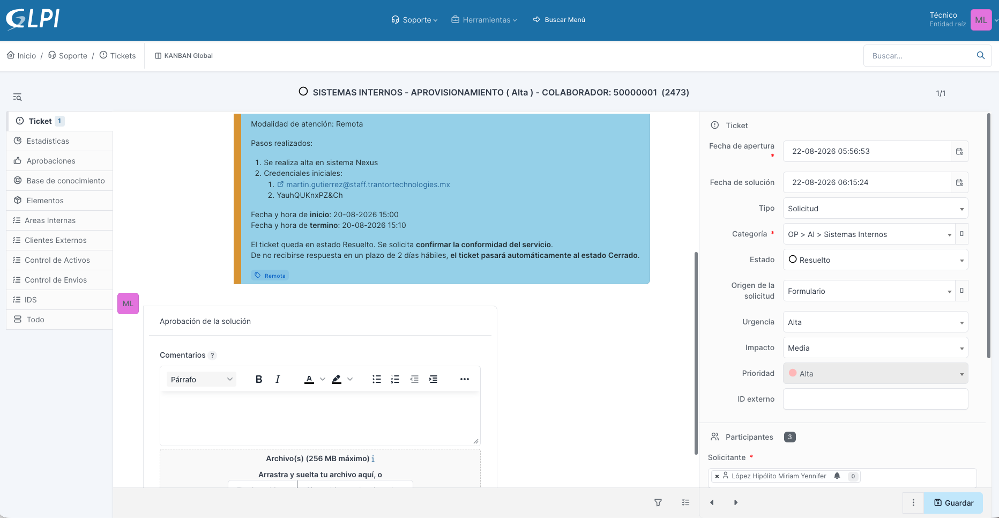

### 10.5 Aprobar o rechazar la solución

Con los datos de acceso en su poder, puede **aprobar** la solución del ticket o **rechazarla** si detecta alguna inconsistencia y requiere una segunda revisión por parte de Sistemas.

<!-- IMG: RRHH_18_GLPI_TICKET_RESUELTO_CON_DATOS_DE_ACCESO_PUEDE_APROVAR_O_NO_SOLUCION -->
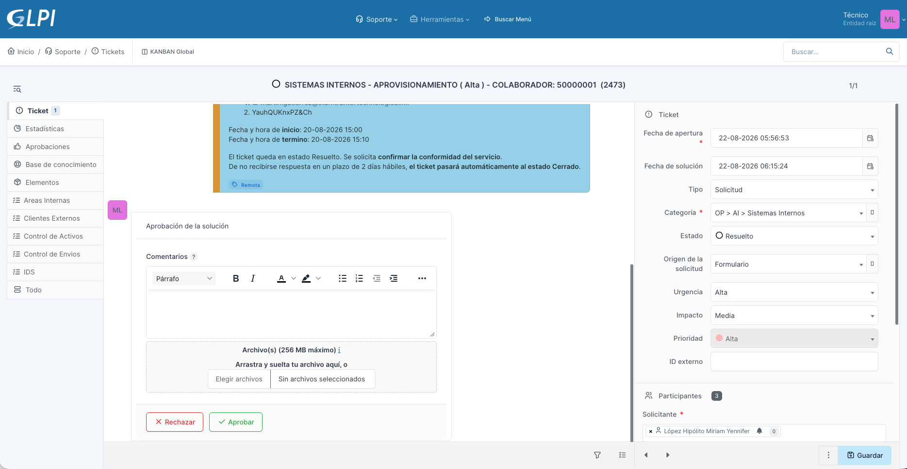

### 10.6 Validar en Nexus

De vuelta en Nexus, confirme que el colaborador ya cuenta en su detalle de información con la cuenta institucional registrada como **Correo principal**.

<!-- IMG: RRHH_19_NEXUS_VALIDACION_DE_APROVISIONAMIENTO -->
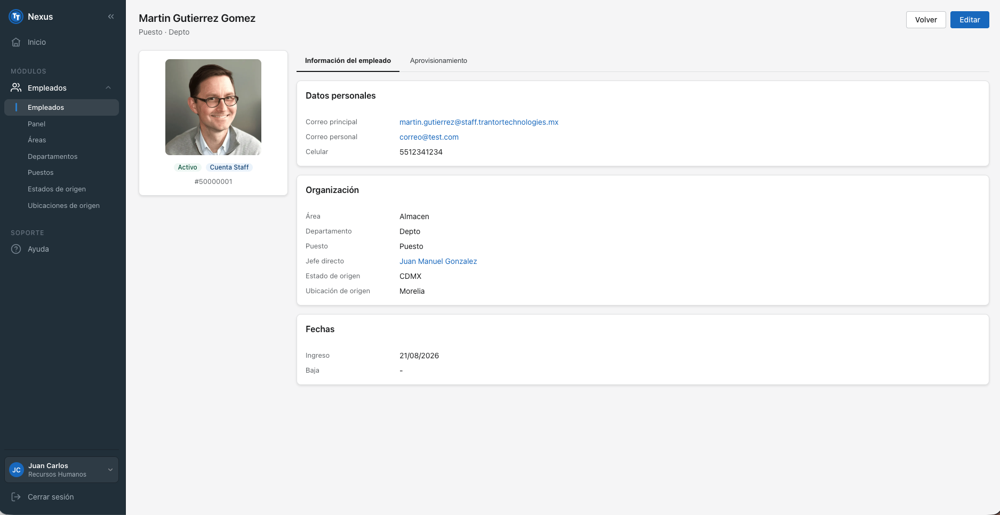

### 10.7 Validar la pestaña de Aprovisionamiento

Realice la misma validación en la pestaña **Aprovisionamiento**. Con esto concluye el flujo de alta del colaborador en Nexus.

<!-- IMG: RRHH_20_NEXUS_VALIDACION_DE_APROVISIONAMIENTO_TAB_APROVISIONAMIENTO -->
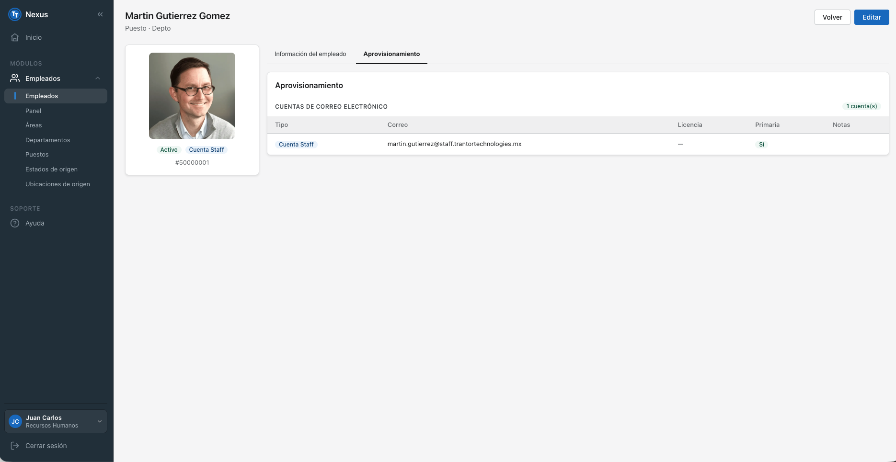

---

## 11. Alta: primer acceso del colaborador

**Responsable:** Colaborador
**Precondición:** RRHH le entregó su correo y contraseña inicial.

Esta sección describe lo que el colaborador visualiza al generarse su acceso. Sirve como guía de acompañamiento para RRHH durante la inducción.

### 11.1 Acceder al correo institucional

Con el correo electrónico y la contraseña recibidos, el colaborador debe dirigirse primero a la URL de inicio de sesión de su correo institucional.

<!-- IMG: IDS_1_MAIL_ACCESO -->
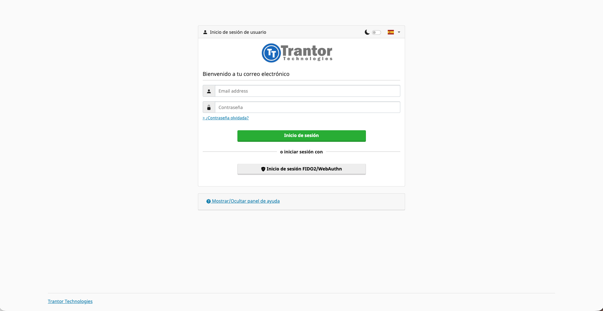

### 11.2 Leer el correo de bienvenida

Al ingresar, lo primero que verá es un correo de bienvenida. Este mensaje también le indica los demás sistemas a los que se le otorgó acceso durante el aprovisionamiento.

<!-- IMG: IDS_2_MAIL_CORREO_DE_BIENVENIDA -->
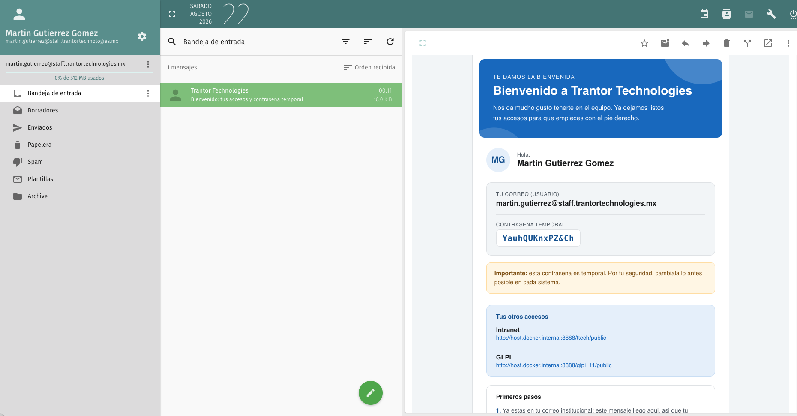

> **Indicación obligatoria:** el correo de bienvenida instruye al colaborador a **cambiar su contraseña de inmediato**, dado que sus credenciales quedaron expuestas en el momento en que RRHH se las hizo llegar.

### 11.3 Acceder a la Intranet

El colaborador puede ingresar a la Intranet con las mismas credenciales iniciales.

<!-- IMG: IDS_3_INTRANET_ACCESO -->
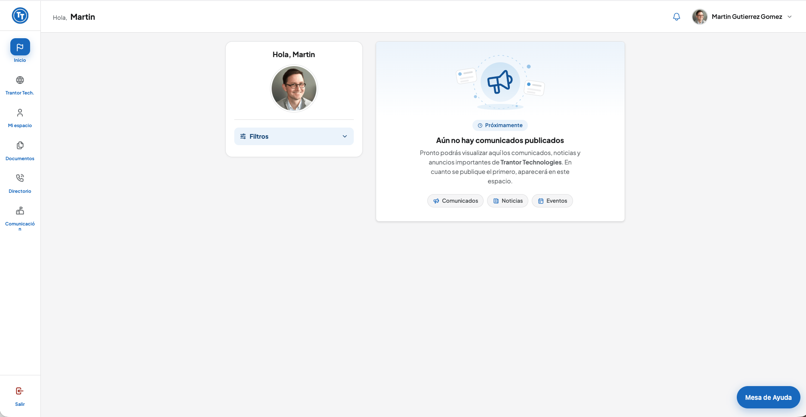

### 11.4 Consultar Mi espacio

La Intranet cuenta con una sección llamada **Mi espacio**, donde el colaborador puede consultar sus datos y su número de empleado.

<!-- IMG: IDS_4_INTRANET_ACCESO_MI_ESPACIO -->
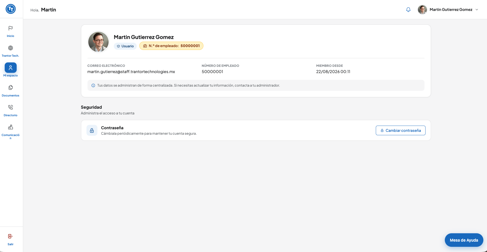

### 11.5 Acceder a GLPI

El acceso a GLPI también funciona con las credenciales iniciales.

<!-- IMG: IDS_5_GLPI_ACCESO -->
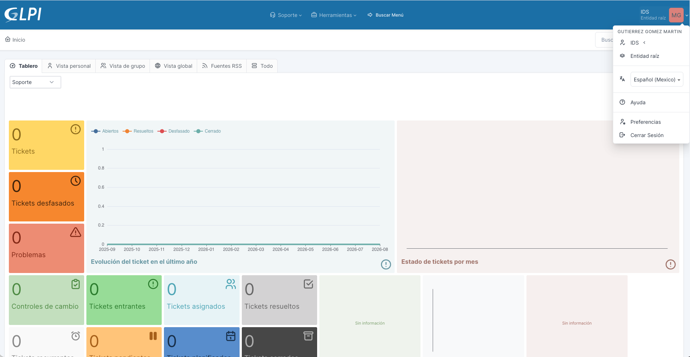

---

# PARTE II: PROCEDIMIENTO DE BAJA

## 12. Baja: actividades de Recursos Humanos

**Responsable:** Recursos Humanos

### 12.1 Generar la solicitud de baja

Para solicitar una baja, utilice el mismo formulario de GLPI empleado en el alta: **Soporte > Catálogo de servicios > Sistemas Internos > Aprovisionamiento de empleados (Nexus)**. En el campo **Tipo de movimiento** seleccione **Baja**.

<!-- IMG: RRHH_21_GLPI_SOLICITUD_DE_BAJA -->
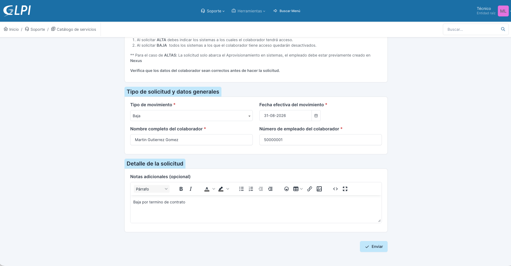

### 12.2 Dar seguimiento a la solicitud

Puede consultar sus tickets en curso y pendientes de atención en **Soporte > Tickets**.

<!-- IMG: RRHH_22_GLPI_TICKET_DE_BAJA_CREADO -->

### 12.3 Consultar el detalle y escalar si es urgente

Haga clic sobre el ticket para ver el detalle de la solicitud.

> **Baja urgente:** si la baja requiere atención inmediata, contacte directamente al área de Sistemas por los medios ya conocidos, como su extensión telefónica. El contacto directo no sustituye la generación del ticket.

<!-- IMG: RRHH_23_GLPI_TICKET_DE_BAJA_CREADO_DETALLE -->
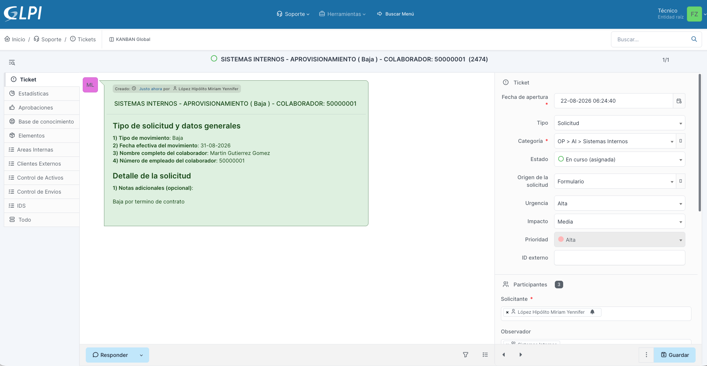

---

## 13. Baja: actividades de Sistemas

**Responsable:** Sistemas
**Precondición:** Existe un ticket de baja asignado en GLPI, con el número de empleado validado.

### 13.1 Ejecutar la baja en Nexus

Localice al colaborador en **Aprovisionamiento > Empleados** y haga clic en **Dar de baja**. Revise que estén seleccionados los mismos sistemas a los que el colaborador tiene acceso.

> **Advertencia crítica: cuentas de Microsoft.** En esta fase Nexus **no está conectado con Microsoft 365**. Si es necesario dar de baja una cuenta de Microsoft, debe ejecutarse **manualmente en la consola de administración de Microsoft**. Nexus no controla este movimiento.

<!-- IMG: SIST_17_NEXUS_BAJA_DE_EMPLEADO -->
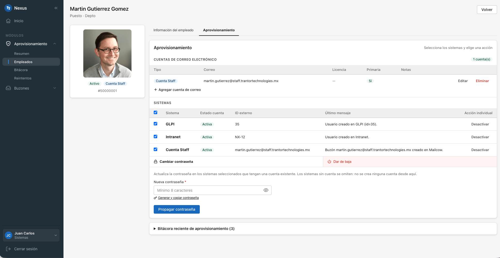

### 13.2 Confirmar la baja

Confirme la operación.

<!-- IMG: SIST_18_NEXUS_BAJA_DE_EMPLEADO_CONFIRMACION -->
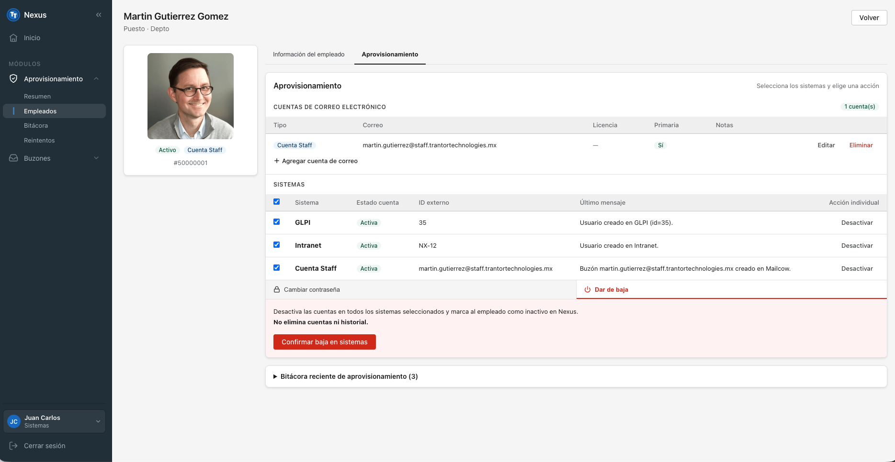

### 13.3 Confirmar por segunda vez

El sistema solicitará una segunda confirmación. Los datos del colaborador no se eliminan, pero después de este paso perderá el acceso a las plataformas.

<!-- IMG: SIST_19_NEXUS_BAJA_DE_EMPLEADO_CONFIRMACION_DOBLE -->
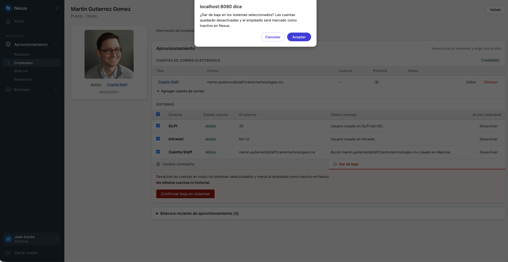

### 13.4 Verificar y documentar

El sistema confirma la baja del colaborador.

> **Recordatorio:** después de cada movimiento debe documentar y solucionar el ticket que lo originó, siguiendo el mismo procedimiento de cierre descrito en los pasos 9.10 a 9.14. Ningún movimiento en Nexus debe ejecutarse sin un ticket de solicitud previo.

<!-- IMG: SIST_20_NEXUS_BAJA_DE_EMPLEADO_CONFIRMACION_DETALLE -->
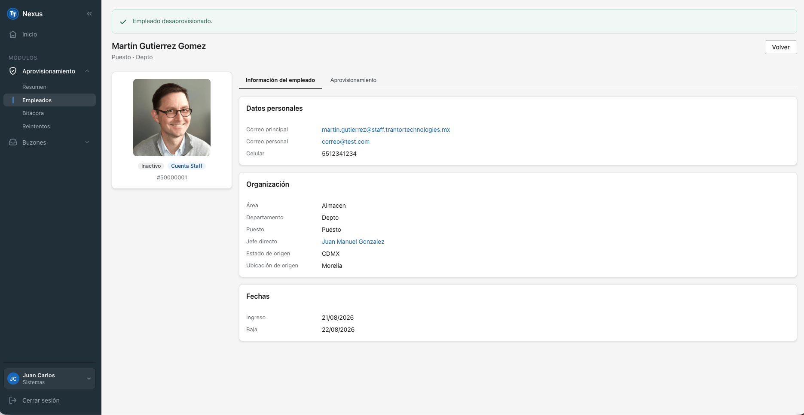

---

# PARTE III: CAMBIO DE CONTRASEÑA

## 14. Cambio de contraseña

**Responsable:** Sistemas
**Precondición:** Existe un ticket de solicitud en GLPI.

### 14.1 Cambio de contraseña en todos los sistemas

Localice al colaborador en Nexus y haga clic en **Generar y copiar contraseña**. Una vez resguardada la contraseña, haga clic en **Propagar contraseña** para aplicarla en los sistemas.

<!-- IMG: SIST_15_NEXUS_CAMBIO_DE_CONTRASENA_A_EMPLEADO -->
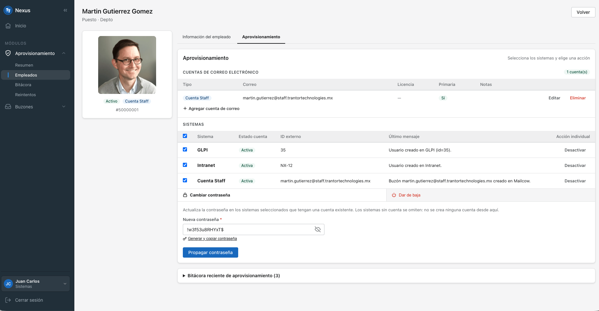

### 14.2 Cambio de contraseña en sistemas específicos

Si únicamente requiere cambiar la contraseña en ciertos sistemas, deje seleccionados solo aquellos a los que desea propagar el cambio. En el ejemplo, el cambio se aplica únicamente a la Intranet.

<!-- IMG: SIST_16_NEXUS_CAMBIO_DE_CONTRASENA_A_EMPLEADO_SELECCIONADO_SISTEMA_OBJETIVO -->
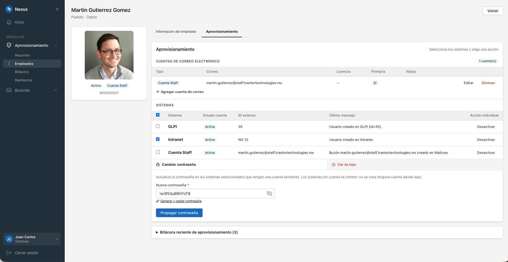

### 14.3 Cierre del movimiento

Documente y solucione el ticket correspondiente en GLPI siguiendo el procedimiento descrito en los pasos 9.10 a 9.14.

---

# ANEXOS

## Anexo A. Checklist de alta

**Recursos Humanos**

- [ ] Expediente creado en Nexus con todos los campos obligatorios
- [ ] Número de empleado validado antes de guardar
- [ ] Fotografía cargada, máximo 1 MB
- [ ] Verificado en la pestaña Aprovisionamiento que no hay correo ligado
- [ ] Ticket generado en GLPI con tipo de movimiento **Alta**
- [ ] Accesos requeridos especificados según el puesto
- [ ] Ticket confirmado como asignado a Sistemas
- [ ] Credenciales obtenidas del ticket resuelto
- [ ] Solución del ticket aprobada
- [ ] Correo principal validado en el expediente de Nexus
- [ ] Credenciales entregadas al colaborador con la indicación de cambio inmediato

**Sistemas**

- [ ] Número de empleado del ticket verificado contra Nexus
- [ ] SLA del ticket revisado
- [ ] Sistemas a aprovisionar verificados contra la solicitud
- [ ] Contraseña generada y resguardada en medio seguro
- [ ] Alta confirmada en Nexus
- [ ] Accesos validados en la pestaña Aprovisionamiento
- [ ] Cuenta de Microsoft 365 gestionada manualmente si aplica
- [ ] Solución clasificada como Resolución - Remota
- [ ] Plantilla completada con los accesos iniciales
- [ ] Solución registrada con el botón Agregar

## Anexo B. Checklist de baja

**Recursos Humanos**

- [ ] Ticket generado en GLPI con tipo de movimiento **Baja**
- [ ] Número de empleado indicado correctamente
- [ ] Escalamiento telefónico realizado si la baja es urgente
- [ ] Solución del ticket validada al cierre

**Sistemas**

- [ ] Número de empleado del ticket verificado contra Nexus
- [ ] Sistemas a revocar verificados
- [ ] Baja ejecutada y doble confirmación completada
- [ ] Cuenta de Microsoft 365 dada de baja manualmente en consola
- [ ] Ticket documentado y solucionado en GLPI

## Anexo C. Errores comunes y qué hacer

| Situación | Acción |
|---|---|
| El número de empleado se capturó mal y ya se guardó | El campo no es editable. Escalar al responsable del área de Sistemas antes de ejecutar cualquier acción. |
| Se perdió la contraseña generada antes de entregarla | Generar una nueva desde Nexus con **Generar y copiar contraseña** y propagarla. Ver sección 14. |
| RRHH no encuentra el ticket en el listado de Tickets | Fue resuelto. Consultar la tarjeta **Tickets resueltos** o buscar por número de ticket. Ver sección 10.2. |
| La solución del ticket contiene datos incorrectos | Rechazar la solución en GLPI para que Sistemas realice una segunda revisión. Ver sección 10.5. |
| El colaborador no puede acceder a un sistema listado en el correo de bienvenida | Verificar en la pestaña Aprovisionamiento de Nexus que el sistema esté efectivamente otorgado. |
| Se dio de baja en Nexus pero la cuenta de Microsoft sigue activa | Comportamiento esperado. Nexus no gestiona Microsoft 365. Ejecutar la baja manualmente en la consola. |
| Se requiere agregar o quitar un acceso sin dar de baja al colaborador | Movimiento fuera del alcance de este manual. Escalar al responsable del área de Sistemas. Ver sección 2.2. |

## Anexo D. Glosario

| Término | Definición |
|---|---|
| **Nexus** | Plataforma interna de gestión del expediente del colaborador y motor de aprovisionamiento de accesos. |
| **GLPI** | Sistema de mesa de servicio utilizado como canal formal de solicitud, seguimiento y evidencia de los movimientos. |
| **Aprovisionamiento** | Proceso de creación y otorgamiento de accesos del colaborador a los sistemas internos. |
| **Desaprovisionamiento o baja** | Revocación de los accesos del colaborador a los sistemas, sin eliminación de su expediente. |
| **Cuenta Staff** | Cuenta de dominio institucional que se genera automáticamente en el aprovisionamiento. |
| **Contraseña inicial** | Credencial temporal generada por Nexus, visible una sola vez, que el colaborador debe cambiar en su primer acceso. |
| **Propagar contraseña** | Acción de aplicar una contraseña nueva a los sistemas seleccionados del colaborador. |
| **SLA** | Acuerdo de nivel de servicio. Define la fecha de vencimiento para la atención del ticket. |
| **Catálogo de servicios** | Sección de GLPI donde se encuentran los formularios de solicitud disponibles por grupo. |
